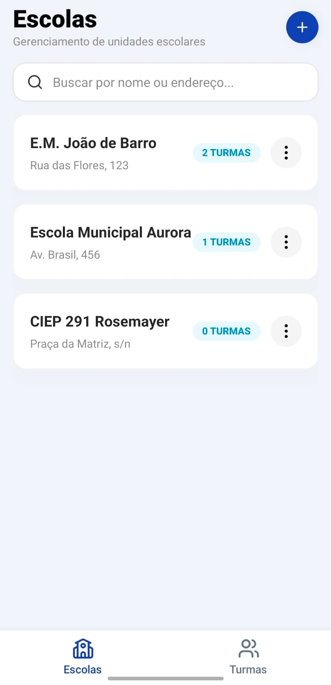
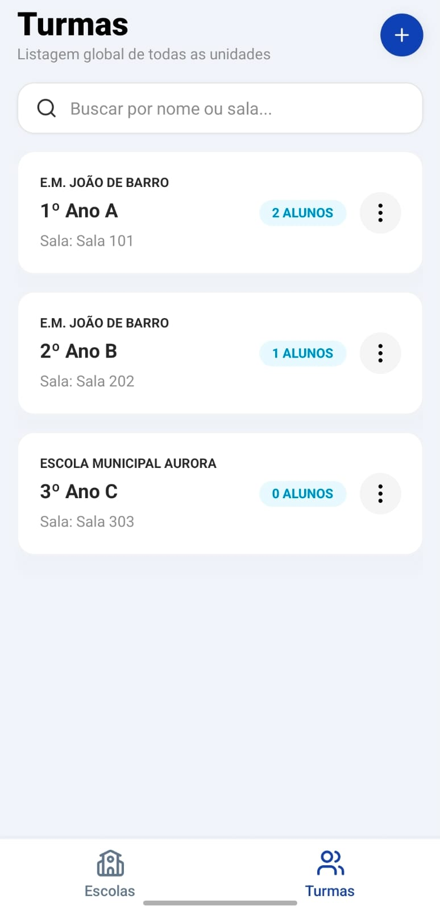
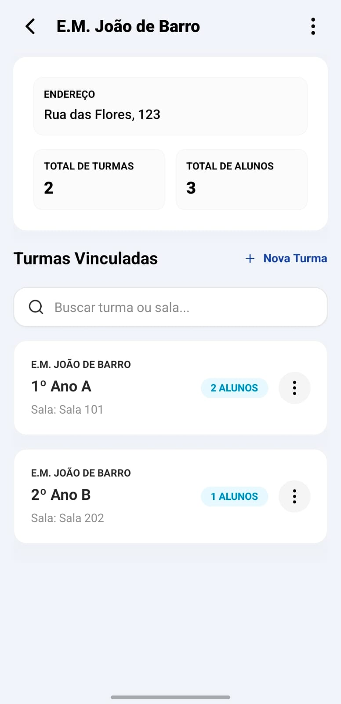

# Prefeduca

Sistema mobile multiplataforma (Android/iOS) para gestão estratégica de redes de ensino municipais. O aplicativo centraliza o controle de unidades escolares, turmas e alunos, otimizando a comunicação e o acompanhamento pedagógico pelas prefeituras.

---

## Índice

- [Versões utilizadas](#versões-utilizadas)
- [Arquitetura](#arquitetura)
- [Pré-requisitos](#pré-requisitos)
- [Instalação](#instalação)
- [Executando o projeto](#executando-o-projeto)
- [Mock de back-end (MSW)](#mock-de-back-end-msw)
- [Rodando os testes](#rodando-os-testes)
- [Versionamento & commits](#versionamento--commits)
- [Estrutura de pastas](#estrutura-de-pastas)
- [Design Patterns](#design-patterns)
- [Funcionalidades](#funcionalidades)

---

## Versões utilizadas

| Ferramenta                | Versão |
| ------------------------- | ------ |
| Node.js                   | 20.x   |
| npm                       | 10.x   |
| Expo SDK                  | 54     |
| React                     | 19     |
| React Native              | 0.81+  |
| TypeScript                | 5.x    |
| Expo Router               | 4.x    |
| Gluestack UI              | 2.x    |
| Zustand                   | 5.x    |
| MSW (Mock Service Worker) | 2.x    |
| Axios                     | 1.x    |
| Zod                       | 3.x    |
| React Hook Form           | 7.x    |
| React Native Reanimated   | 3.x    |
| AsyncStorage              | 2.x    |

---

## Arquitetura

O projeto segue uma organização **domain-driven (feature-based)**, onde cada domínio educacional é isolado em seu próprio módulo, garantindo alta coesão e baixo acoplamento.

Os design patterns aplicados são:

- **Adapter** — isola o Axios do restante da aplicação (`core/http/http.adapter.ts`).
- **Repository** — abstrai o acesso a dados via interface TypeScript (`features/*/repository.ts`).
- **Store (Zustand)** — Gerenciamento de estado global e reativo com persistência.
- **Factory** — garante a injeção correta de dependências nos repositórios (`features/*/factory.ts`).

---

## Pré-requisitos

- **Node.js** 20 ou superior — [nodejs.org](https://nodejs.org)
- **npm** 10 ou superior
- **Expo Go** instalado no dispositivo físico — [expo.dev/go](https://expo.dev/go)

---

## Instalação

```bash
# 1. Clone o repositório
git clone https://github.com/GabrielCostaLuiz/prefeduca.git
cd prefeduca

# 2. Instale as dependências
npm install
```

---

## Executando o projeto

```bash
# Inicia o servidor de desenvolvimento
npx expo start
```

Após rodar o comando, utilize o **Expo Go** para escanear o QR Code.

> O mock de back-end (MSW) é iniciado automaticamente junto com o app em modo de desenvolvimento através das configurações no `app/_layout.tsx`.

---

## Mock de back-end (MSW)

O projeto utiliza **Mock Service Worker (MSW)** para simular o ambiente de produção, permitindo o desenvolvimento completo das funcionalidades sem depender de um servidor externo pronto.

### Endpoints principais

| Método | Endpoint                     | Descrição                                 |
| ------ | ---------------------------- | ----------------------------------------- |
| GET    | `/schools`                   | Lista todas as unidades escolares         |
| POST   | `/schools`                   | Cadastra uma nova escola                  |
| GET    | `/schools/:id/classes`       | Lista as turmas de uma unidade específica |
| POST   | `/schools/:id/classes`       | Cria uma nova turma para a escola         |
| GET    | `/classes/:id/students`      | Lista os alunos de uma turma              |
| POST   | `/classes/:id/students`      | Matricula um novo aluno na turma          |
| DELETE | `/students/:id`              | Remove um registro de aluno               |

---

## Rodando os testes

```bash
# Execução completa
npm test

# Modo interativo (watch)
npm run test:watch
```

---

## Versionamento & commits

O projeto utiliza **Husky** + **Commitlint** + **lint-staged** para garantir que cada commit siga as boas práticas.

### Padrão — Conventional Commits

```
<tipo>(<escopo>): <descrição curta>

exemplo:
  feat(schools): implementa busca de unidades por endereço
  fix(students): corrige ordem da chamada automática
```

---

## Estrutura de pastas (Feature-Root)

Diferente da estrutura tradicional, adotamos o modelo **Flattened Feature**, onde lógica e componentes de uma mesma funcionalidade vivem no mesmo diretório:

```
/
├── app/                        # Expo Router — Rotas file-based
├── features/                   # Módulos de negócio (achatados)
│   ├── schools/                # Gestão de Escolas (Store, Repos, Screens, UI)
│   ├── classes/                # Gestão de Turmas
│   └── students/               # Gestão de Alunos
├── core/
│   ├── http/                   # AxiosHttpAdapter e interfaces
│   ├── mocks/                  # MSW handlers e Banco de dados simulado
│   └── storage/                # AsyncStorage adapter
└── components/                 # Design System compartilhado
    └── ui/                     # Gluestack UI base components
```

---

## Funcionalidades Principais

### Gestão de Unidades Escolares
- Visualização de todas as escolas da rede.
- Indicadores rápidos: total de turmas e alunos por unidade.
- Busca por nome ou endereço.

### Controle de Turmas
- Organização por salas e turnos.
- Listagem global ou filtrada por escola.
- Sincronização em tempo real do total de matrículas.

### Gestão de Alunos
- Cadastro rápido com geração automática de **número de chamada**.
- Listagem detalhada dos alunos com busca instantânea.
- Gestão de movimentação (transferências/saídas).

---

## Design System

O app utiliza **Gluestack UI v2** e **NativeWind**, seguindo uma paleta de cores institucional vibrante, com foco em:
- **Acessibilidade:** Fontes legíveis e alto contraste.
- **Feedback Visual:** Uso de Skeletons, Empty States e Error States padronizados.
- **Modernidade:** Sombras suaves (`shadow-soft-4`) e cantos arredondados (`rounded-xl`).

---

## Screenshots

<div align="center">
  
  
  
  
  <p><i>Fluxo de Escolas, Detalhes da Unidade, Listagem de Turmas e Cadastro de Alunos</i></p>
</div>
